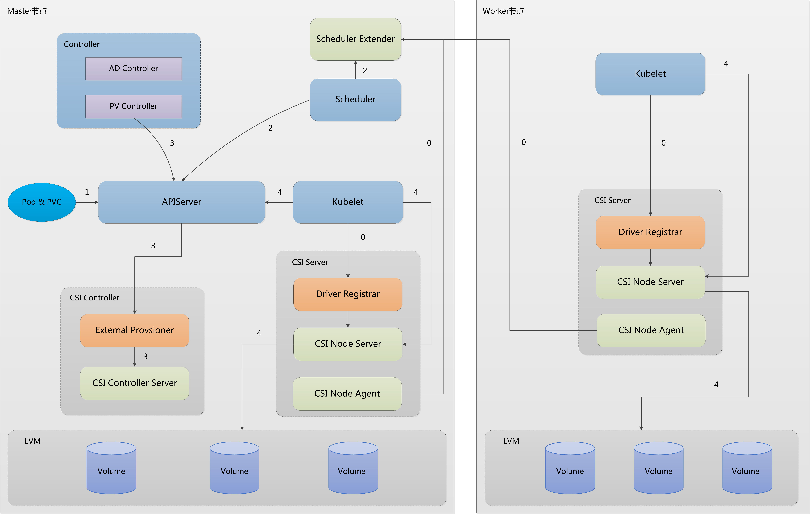
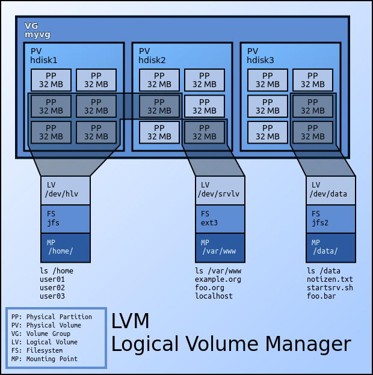

# Kubernetes Local Volume CSI Plugin

## Overview

Local Volume CSI Plugins implement an interface between CSI enabled Container Orchestrator. It allows dynamically provision Local Disk
volumes and attach it to workloads.

## Architectural Design



## LVM Design



## Quick Start

### Deploy

1. Clone the project on your Kubernetes cluster master node:
```
$ git clone https://github.com/kubernetes-local-volume/kubernetes-local-volume.git
$ cd kubernetes-local-volume
```

2. To deploy the Plugin on your Kubernetes cluster, please run the following script:
```
$ make deploy
```

3. Use command ```kubectl get pods -n kube-system```to check Local Volume Plugin status like:
```
NAMESPACE       NAME                                      READY   STATUS      RESTARTS   AGE
kube-system     local-volume-csi-node-server-cfgdx        3/3     Running     0          29m
kube-system     local-volume-csi-node-server-d4r9t        3/3     Running     0          29m
kube-system     local-volume-csi-node-server-lbk2l        3/3     Running     0          29m
kube-system     local-volume-csi-provisioner-0            1/1     Running     0          29m
kube-system     local-volume-scheduler-5db76cc95f-tmt6n   1/1     Running     0          29m
```

4. Run example
```
$ make start-test

$ kubectl get pods
NAMESPACE       NAME                                      READY   STATUS      RESTARTS   AGE
default         deployment-lvm-6795459b9b-dp8xx           1/1     Running     0          10m

$ kubectl get pvc
NAME                   STATUS   VOLUME                                              CAPACITY   ACCESS MODES   STORAGECLASS       AGE
local-volume-csi-pvc   Bound    local-volume-19eb5214-a003-11ea-bf25-fa163ecf44f1   1Gi        RWO            local-volume-csi   12m

$ kubectl get pv
NAME                                                CAPACITY   ACCESS MODES   RECLAIM POLICY   STATUS   CLAIM                          STORAGECLASS       REASON   AGE
local-volume-19eb5214-a003-11ea-bf25-fa163ecf44f1   1Gi        RWO            Delete           Bound    default/local-volume-csi-pvc   local-volume-csi            13m
```

5. undeploy
```
$ make undeploy
```
